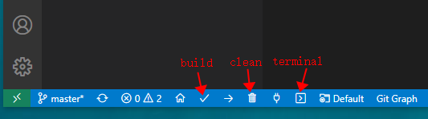

# Snapmaker 2.0 Modules Firmware

Snapmaker2-Modules is an all-in-one firmware for Modules of Snapmaker 2.0 3-in-1 3D Printers, it gets the Device Id of the current module from flash and then performs different business logic accordingly.

## Documentation

Snapmaker2-Modules is developed to run in the following modules:

- Linear module
- 3D printer tool head
- Laser tool head
- CNC tool head
- Enclosure
- etc.

Currently there are two branches in this repository, The **main** branch contains all features of currently released modules, but firmware size will be larger.If you want to modify or enhance the features of existing snapmaker2 modules, you can do so through the **main** branch.

The **common** branch is a clean branch, it does not contain the business logic of a specific module, but only contains the common features that all modules need to implement, such as upgrading firmware, configuring message id, etc. If you want to develop a new module and don't want your firmware to contain the business logic of the snapmaker2 modules, you can do so via the **common** branch.

### Feedback & Contribution

- To submit a bug or feature request, [file an issue](https://github.com/Snapmaker/Snapmaker2-Modules/issues/new) in github issues.
- To contribute some code, make sure you have read and followed our guidelines for [contributing](https://github.com/Snapmaker/Snapmaker2-Modules/blob/main/CONTRIBUTING.md).

## Development

### Setup Development Environment

we use **Visual Studio Code** and **PlatformIO IDE** to develop Snapmaker2-Modules.

- Follow [Setting up Visual Studio Code](https://code.visualstudio.com/docs/setup/setup-overview) to install and setup **VSCode**.
- Follow the [guide](https://platformio.org/install/ide?install=vscode) to install PlatformIO extension in **VSCode**.
- Clone [Snapmaker2-Modules repo](https://github.com/Snapmaker/Snapmaker2-Modules) using Git to your local folder.

```shell
> git clone git@github.com:Snapmaker/Snapmaker2-Modules.git
```

- Open downloaded repo in **VSCode**
  - Use the **Open Folder…** command in the **VSCode** **File** menu
  - Then choose top folder of **Snapmaker2-Modules** in your location
- After opening the source code in **VSCode**, you will see these icons at the bottom status bar，it also indicates PlatformIO has been installed successfully.



### Compile the code

- To compile the code, you have two ways:
  - click the **build** icon in status bar
  - click the **terminal** icon to open terminal, then type command ***pio run***

NOTE: if you build the source for first time, PlatformIO will download the relative libraries and toolchains. It may take a few minutes.

- After PlatformIO finishing the build, you will get two images:
  - `(PROJECT FOLDER)/.pioenvs/genericSTM32F103TB/firmware.bin`: image to be programmed into modules by programmer with specific address of flash.
  - `(PROJECT FOLDER)/.pioenvs/genericSTM32F103TB/firmware.elf`: image used to debug the firmware (in online debug tools like Ozone)
- To clean previous build, just click the **clean** icon, or type command ***pio run -t clean*** in the terminal.

### Program compiled firmware to modules

After building, please type below command in VSCode terminal

```shell
> pio run -t pack
```

then you will get below firmwares in folder `(PROJECT FOLDER)/release`:

* `firmware.bin`: raw binary of firmware.
* `firmware.elf`: firmware with debug information.
* `SM2_EM_APP_{xxx such as V1.9.1}_{xxx such as 20201220}.bin`: minor image of module, can be used to generate major image
* `Snapmaker_{xxx: version such as V1.9.1}_{xxx: date such as 20201220}.bin`:  major image which can be used to upgrade modules with USB stick:
  * Copy it to your USB stick
  * Plug USB stick to Controller
  * Type the firmware file in Screen
  * Check the module version by Gcode M1005 in console after upgrading

## License

Snapmaker2-Modules is released under terms of the GPL-3.0 License.

Terms of the license can be found in the LICENSE file or at https://www.gnu.org/licenses/gpl-3.0.en.html.